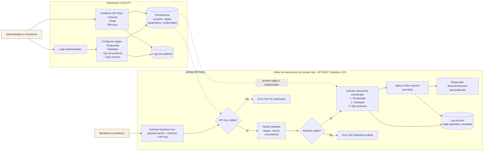

# Diagrama de Flujo MVP LOYALTY

```mermaid
flowchart LR
    A[Administrador e-commerce]:::actor
    E[Backend e-commerce]:::actor

    subgraph D[Dashboard LOYALTY]
      D1[Login administrador]
      D2[Configurar reglas:
- Temporada
- Fidelidad
- Tipo de producto
- Tope maximo]
      D3[Gestionar API Keys:
- Generar
- Rotar
- Revocar]
      D4[(Persistencia:
usuarios, reglas,
parametros, credenciales)]
      D5[(Logs de auditoria)]
    end

    subgraph R[Motor de descuentos en tiempo real - API REST Stateless S2S]
      R1[Solicitud checkout con payload carrito + metricas + API Key]
      R2{API Key valida?}
      R3[Validar payload:
rangos, vacios,
consistencia]
      R4{Payload valido?}
      R5[Calcular descuento combinado:
1. Temporada
2. Fidelidad
3. Tipo producto]
      R6[Aplicar limite maximo permitido]
      R7[Responder descuento/precio personalizado]
      R8[(Log tecnico:
regla aplicada y resultado)]
      R9[Error 401 No autorizado]
      R10[Error 400 Solicitud invalida]
    end

    A --> D1 --> D2 --> D4
    A --> D3 --> D4
    D2 --> D5
    D3 --> D5

    E --> R1 --> R2
    R2 -- No --> R9
    R2 -- Si --> R3 --> R4
    R4 -- No --> R10
    R4 -- Si --> R5 --> R6 --> R7
    R5 --> R8
    R6 --> R8

    D4 -. provee reglas y credenciales .-> R5
    D4 -. provee API Keys .-> R2

    classDef actor fill:#f7f2e8,stroke:#7a5c2e,color:#2e2517,stroke-width:1px;
```